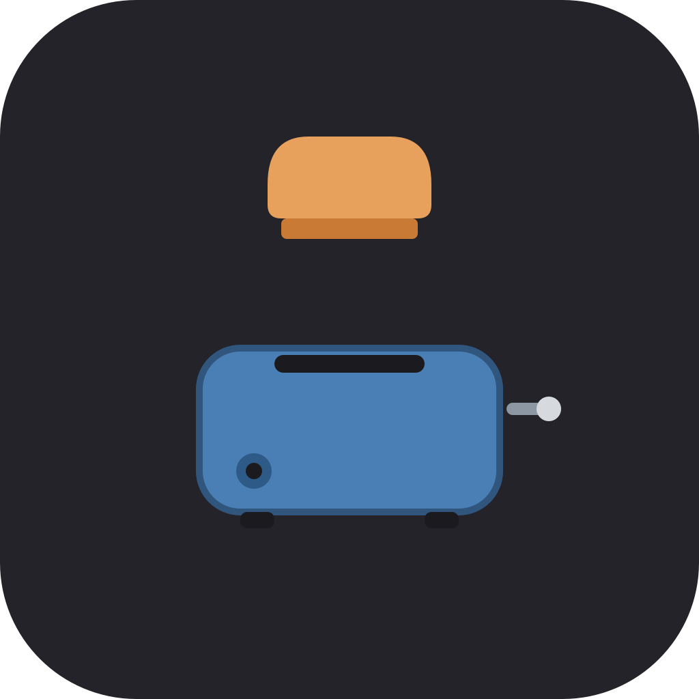

# toaster

A pocket-sized Blender-style 3D modeler built with Flutter. One codebase
runs on Android, iOS, Linux, Windows, macOS, and the web.



## Features

- Orbit / pan / zoom camera (middle mouse drag, wheel, numpad views)
- Object and edit modes (Tab)
- Ten primitives: cube, plane, circle, UV sphere, icosphere, cylinder,
  cone, truncated cone, torus, grid, and monkey
- Click-to-select ray casting, multi-select, outliner with visibility toggles
- G / R / S transforms with X / Y / Z axis locks, snapping, and gizmo handles
- Edit mode: vertex / edge / face selection, extrude (E), inset (I),
  fill (F), subdivide, merge by distance (M), flip normals, delete
- Modifier stack: mirror, array, subdivision surface, bevel, solidify
- Solid, wireframe, and material-preview shading with a flat-shaded
  software renderer (pure Dart, no GPU dependencies)
- Materials: base color, metallic, roughness, smooth shading
- Undo / redo (Ctrl+Z / Ctrl+Shift+Z)
- `.toast` JSON scene save/load, OBJ import/export
- Adaptive layout: full panel chrome on desktop, compact tool strip on mobile

## Shortcuts

| Key | Action |
| --- | --- |
| Tab | Toggle edit mode |
| 1 / 2 / 3 | Vertex / edge / face select mode (or view presets in object mode) |
| G / R / S | Grab, rotate, scale |
| X / Y / Z | Constrain transform to axis |
| E / I / F / M | Extrude, inset, fill, merge by distance (edit mode) |
| A / Alt+A | Select all / deselect all |
| Del | Delete selection |
| Shift+D | Duplicate |
| Ctrl+J | Join objects |
| Ctrl+N / Ctrl+S | New scene / save |
| Ctrl+Z / Ctrl+Shift+Z | Undo / redo |
| . / Home | Frame selected / frame all |
| 5 | Toggle perspective / ortho |
| Z | Cycle shading |

## Building

```bash
flutter pub get
flutter run                    # current device
flutter build apk --release    # android
flutter build web --release    # web
flutter build linux --release  # linux (also windows/macos/ios)
```

## Testing

```bash
flutter analyze
flutter test --coverage
```

The test suite enforces 100% line coverage on `lib/` and includes golden
screenshots for the desktop and mobile layouts.

## Releases

Every push to `main` is mirrored to GitHub where a workflow builds all
platforms. Versioned releases are cut automatically by cocogitto
(conventional commits -> `cog bump --auto`), then synced back to a GitLab
release whose package registry hosts the binaries. The web build is
published on GitLab Pages and an AltStore source JSON is regenerated for
each iOS release.

## License

AGPL-3.0-only. See [LICENSE](LICENSE).
